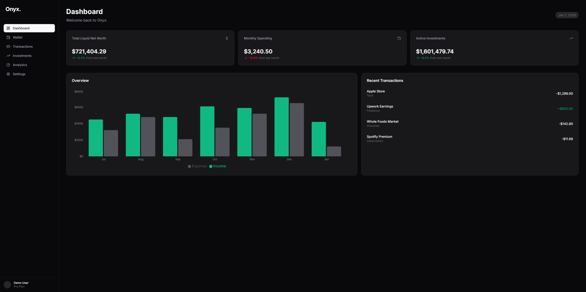

# Onyx Dashboard



**Onyx** is a high-performance, sleek, and modern financial dashboard designed for high-net-worth individuals. It aggregates data across banking, brokerage, and crypto portfolios into a unified, privacy-focused interface.

Built with **Next.js 16 (App Router)** and **TypeScript**, it features a responsive "Onyx" design system, interactive financial charting, and a "real-feel" digital wallet.

## Features

* **Global Asset Overview:** Real-time tracking of Liquid Net Worth, Monthly Burn, and Active Investments.
* **Digital Wallet:** A visually rich wallet interface featuring photorealistic credit card skins (Amex, Chase, Apple Card) with dynamic tilt effects.
* **Smart Analytics:** Interactive visualizations for cash flow (Income vs. Expense) and category spending breakdowns using Recharts.
* **Deep-Dive Asset Pages:** Dynamic routing (`/wallet/[id]`) that renders different layouts for Credit Cards (APR, Due Dates) vs. Bank Accounts (Routing #, Transfers).
* **Transaction Intelligence:** Detailed history with merchant logos, automatic categorization, and multi-account filtering.
* **Responsive Design:** Fully optimized for desktop, tablet, and mobile views.

## Tech Stack

* **Framework:** [Next.js 16](https://nextjs.org/) (App Router & Turbopack)
* **Language:** [TypeScript](https://www.typescriptlang.org/)
* **Styling:** [Tailwind CSS](https://tailwindcss.com/)
* **Components:** [Shadcn/UI](https://ui.shadcn.com/) (Radix Primitives)
* **Charting:** [Recharts](https://recharts.org/)
* **Icons:** [Lucide React](https://lucide.dev/)
* **Deployment:** [Vercel](https://vercel.com/)

## Getting Started

1. First, clone the repository and install the dependencies:

    ```bash
    git clone [https://github.com/your-username/onyx-dashboard.git](https://github.com/your-username/onyx-dashboard.git)
    cd onyx-dashboard
    npm install
    ```

1. Run the development server:
    ```bash
    npm run dev
    ```

1. Open ```http://localhost:3000``` with your browser to see the result.

## Project Structure

```bash
├── public/              # Static assets
├── src/
│   ├── app/             # Next.js App Router pages
│   │   ├── analytics/   # Analytics views
│   │   ├── investments/ # Portfolio tables
│   │   └── wallet/      # Dynamic account details
│   │       └──[id]      # id details
│   ├── components/      # Reusable UI components
│   │   └── ui/          # Shadcn primitives
│   └── lib/             # Utilities and Mock Data adapter
```

## Design Philosophy
Onyx follows a "Data-First, Dark-Mode" philosophy.

* **Visual Hierarchy:** Key KPIs (Net Worth, Burn Rate) are elevated.
* **Color Theory:** Uses a strict Zinc palette with semantic colors only for financial status (Emerald for Gains, Amber for Warnings).
* **Interactivity:** Hover states, scale effects, and glassmorphism add depth without clutter.

## Future Roadmap
* **Command Menu:** Global search (Cmd+K) for rapid navigation.
* **Live APIs:** Integration with Plaid for real banking data.
* **Auth:** Secure login with NextAuth.js.

##

*Built by Shubh Gupta*